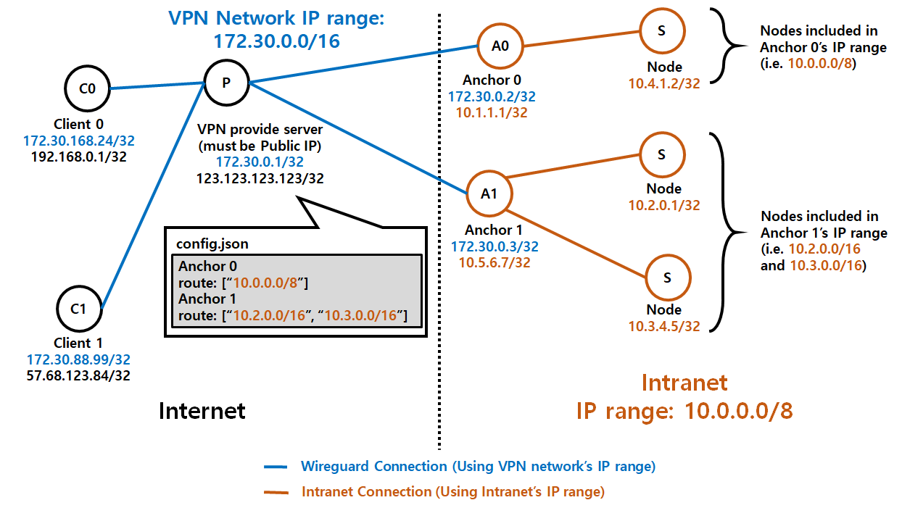

# AnchorVPN


AnchorVPN is Wireguard VPN managing server. The goal of AnchorVPN is everyone's easy accessing to an intranet in a firewall (e.g. School Network, Company Network, etc...) By AnchorVPN, multiple user can easily get VPN without special coding or typing.

# How to Setup? (by example)

There are four types of computers in a whole network: `VPN provider`, `anchor`, `client`, `node`. You only set `VPN provider` and `anchor`. In this tutorial, I'm going to bring all the examples from this diagram:



## `anchor` Setup

###  Allow IP forwarding

The IP forwarding is a routing method of tossing packets which destination is not a current node. Because `anchor` isn't the destination of packets from `client`s or `node`s, `anchor` requires IP forwarding. By modifying `/etc/sysctl.conf`, you can permanently allow IP forwarding.
```
net.ipv4.ip_forwarding=1
```
This is a permanent setting but it can be applied on the next booting. For not a permanent but an instant applying, you can type this command on your shell:
```bash
sysctl -w net.ipv4.ip_forwarding=1
```
I would suggest conducting both methods.

### Install Wireguard

You can download Wireguard using your OS's package manager. For example, in ubuntu (below 19.04)
```bash
add-apt-repository ppa:wireguard/wireguard
apt-get update
apt-get install wireguard
```
You can check the installation manual at [Wireguard official page](https://www.wireguard.com/install/)

### Generate Wireguard Key Pair

The next step is generating a public and private key. The name of the public key is `wg0-pub.key` and of the private key is `wg0-priv.key`.

```bash
cd /etc/wireguard/
umask 077
wg genkey | tee wg0-priv.key | wg pubkey > wg0-pub.key
```

You can get `anchor`'s private key by simply `cat` command:

```bash
cat /etc/wireguard/wg0-pub.key
```

### Set Wireguard Configuration

Then, make a new file at `/etc/wireguard/wg0.conf`, and write like that:

```
[Interface]
PrivateKey = <Anchor's private key>
PreUp = iptables -t nat -A POSTROUTING -s <VPN network's IP range, CIDR format> -o <Interface name of anchor's LAN port> -j MASQUERADE
PostDown = iptables -t nat -D POSTROUTING -s <VPN network's IP range, CIDR format> -o <Interface name of anchor's LAN port> -j MASQUERADE
Address = <Anchor's IP address in VPN network, CIDR format>

[Peer]
PublicKey = <VPN provider's public key>
Endpoint = <VPN provider's server address or domain>:<VPN provider's UDP port for Wireguard>
AllowedIPs = <VPN network's IP range, CIDR format>
PersistentKeepalive = 5
```

For example, in the diagram at section 2-2, Anchor 1's setting is like this:

```
[Interface]
PrivateKey = <Anchor's private key>
PreUp = iptables -t nat -A POSTROUTING -s 172.30.0.0/16 -o eno1 -j MASQUERADE
PostDown = iptables -t nat -D POSTROUTING -s 172.30.0.0/16 -o eno1 -j MASQUERADE
Address = 172.30.0.3/32

[Peer]
PublicKey = <VPN provider's public key>
Endpoint = 123.123.123.123:54321
AllowedIPs = 172.30.0.0/16
```

**Leave `VPN provider`'s public key, then fill it up after generating a key pair on `VPN provider`**

### Run Wireguard

Just type this command:
```bash
wg-quick up wg0
```
and make sure autostart on reboot
```bash
systemctl enable wg-quick@wg0
systemctl daemon-reload
```

## `VPN provider` Setup

### Allow IP forwarding

This part is exactly same as `anchor`'s one.

Modifying `/etc/sysctl.conf`, you can permanently allow IP forwarding.
```
net.ipv4.ip_forwarding=1
```
Type this command on your shell:
```
sysctl -w net.ipv4.ip_forwarding=1
```

### Generate Wireguard Key Pair

This part is exactly same as `anchor`'s one.

The next step is generating a public and private key. The name of the public key is `wg0-pub.key` and of the private key is `wg0-priv.key`.

```bash
cd /etc/wireguard/
umask 077
wg genkey | tee wg0-priv.key | wg pubkey > wg0-pub.key
```

**On `VPN provider`, you only need to generate the key pair. AnchorVPN automatically generate `wg0.conf` so don't create wg0 or type `wg-quick up wg0` currently on this part.**

### UDP port open

No need to use `ufw` or `firewalld`, Just need `iptables` only. It is the most basic and classical firewall tool throughout the whole Linux family.
```
iptables -S
```
If you get lines of `-P FORWARD ACCEPT` and `-P INPUT ACCEPT`, well that's okay but the security of your server is in danger. Many people usually work on SSH and you don't want to block SSH port number, so you can type like this:
```
iptables -A INPUT -m conntrack --ctstate RELATED,ESTABLISHED -j ACCEPT
iptables -A INPUT -p tcp -m tcp --dport <SSH port> -j ACCEPT
iptables -A INPUT -p udp -m udp --dport <VPN port> -j ACCEPT
iptables -A INPUT -i lo -j ACCEPT
iptables -P INPUT DROP
iptables -P FORWARD DROP
```
For example, `<SSH port>` = 22, `<VPN port>` = 54321

### Install Go

[Go](https://golang.org/) is a modern language developed by Google, suitable for modern computer architecture (multi-core, I/O async...). AnchorVPN uses golang.
```bash
apt-get install golang-go
```

### Set `config.json`
You should modify `config.json` before running AnchorVPN. In the diagram situation, the JSON file can be written like this:

```json
{
    "vpn" : {
        "network" : "172.30.0.1/16",
        "route" : "10.0.0.0/8"
    },
    "server" : {
        "domain" : "123.123.123.123",
        "port" : "54321",
        "interface" : "wg0",
        "key" : {
            "private" : "/etc/wireguard/wg0-priv.key",
            "public" : "/etc/wireguard/wg0-pub.key"
        }
    },
    "anchor" : [
        {
            "ip" : "172.30.0.2/32",
            "route" : [ "10.0.0.0/8" ],
            "key" : {
                "public" : "<anchor 0's public key>"
            }
        },
        {
            "ip" : "172.30.0.3/32",
            "route" : [ "10.2.0.0/16", "10.3.0.0/16" ],
            "key" : {
                "public" : "<anchor 1's public key>"
            }
        }
    ]
}
```

### Run

After complete `config.json`, finally, the whole system can be on running.

[tmux](https://github.com/tmux/tmux/wiki) is a widely used terminal multiplexer. For running AnchorVPN in the background, we need this terminal multiplexer. Other options for process background running is `screen` or adding `&` on the back site of command, but it is not my recommendation. You can install tmux by:
```bash
apt-get install tmux
```
Create a new session using:
```bash
tmux new -s <session name>
```
For example, `<session name>` = anchorvpn. Then type this:
```bash
chmod 755 ./run.sh
./run.sh
```
Detach tmux session by pressing `ctrl + b` then `d`. You're done!

If you want to attach the background session:
```bash
tmux attach -t <session name>
```

### Logging

The logfile is `vpn.log` and the current client database is `clients.db`. The type of the database is [BoltDB](https://github.com/boltdb/bolt). If you have `ccze` then you can keep watching logs by this command:
```bash
watch -n 0.3 -c "cat vpn.log | last -20 | ccze -A"
```

### Use on HTTP

Provide normal Wireguard configuration for desktop:
```
http://<ip or domain name>:8000/
```

Provide QR code Wireguard configuration for mobile:
```
http://<ip or domain name>:8000/qrcode
```

JSON formatted client lists:
```
http://<ip or domain name>:8000/client-list
```

## The overall features of AnchorVPN

### Predefined Time Duration for a False-positive Configuration

When a user access AnchorVPN server on HTTP, the user immediately gets a Wireguard configuration.

- If the user copy&paste and activate the configuration within predefined time duration (default is **180 seconds; 3 minutes**) from the issuing, the user has accessibility to the intranet.

- In other words, if the user can't activate the configuration within the predefined time duration, the issued configuration will be deleted immediately, and the user must re-access the HTTP site and get a new configuration.

This "predefined time duration" feature is for preventing bot attacking and human error, which can be called as false-positive configuration:

- The attacking bot just randomly ding-dong ditches every websites on the internet, and this action could make shortage of IP on the VPN network.

- Also human can just type AnchorVPN server's URL several times without reasons.

**You can modify this value by changing the variable `unusedTime` at `main.go`.**

### DHCP-like VPN Leasing

Wireguard protocol sends heartbeats to each other. Therefore, if this heartbeat won't come to the VPN provider, the allocated IP is wasted until the user comes back. To prevent shortage of IP on VPN network, lease time (default 3 days) is given for every client.
- If a client doesn't turn on and activate a Wireguard client at least once during the lease time, the client's configuration is expired and deleted. In this situation, the client must re-access the HTTP site and get a new configuration.
- In other words, if a client makes the Wireguard client remain as activated, the client doesn't need to re-issue configuration.

**You can modify this value by changing the variable `leaseTime` at `main.go`.**

### Tollbooth-based Rate Limiting

To prevent Denial-of-Service (DoS) and Distributed DoS (DDoS), AnchorVPN adopted tollbooth-based rate limiting. This doesn't act like banning, blocking or blacklisting IP. Tollbooth is open-minded and fair to everyone, so AnchorVPN's rate limiting just allows 1 request per 1 seconds.
- If 3 requests are arrived to the VPN provider within 1 second, 2 of 3 requests are ignored, only one request is allowed, and a configuration will be issued for that single request.


## FAQ

### Why Does AnchorVPN Use Wireguard?

By the power of Wireguard, AnchorVPN doesn't send all traffic to an intranet. Your internet speed won't slow down like LDAP, VPNGate, IPsec...


### I Have Wireguard. Do I Have to Install AnchorVPN?

Wireguard is a simple and fast VPN protocol. In standalone, Wireguard is nice, yet it requires tiresome manual jobs such as `wg add ...` or `wg-quick` commands. AnchorVPN provides a completely automatic solution for these shell commands.

## Contributions

**AnchorVPN is actually my personal project for my convenience.**

- It might act horribly on your environment. I'm not a Google or Facebook, so I'm not ensure.

You can fork my project without my permission. The license is MIT.

- It's enough to write my name `Heeyong Yoon` on your README.md

If you have any questions, feel free to ask using Github issue or [my email](mailto:sunrise2575@dgist.ac.kr)

- But please don't send about Wireguard, Golang, Gorilla, Tollbooth, etc... These are 3rd parties
