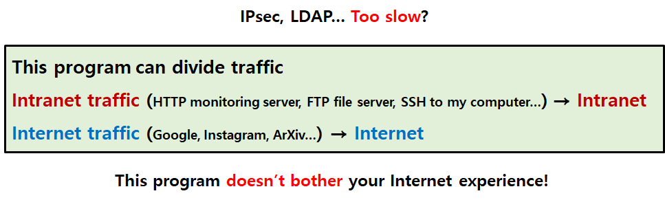

# AnchorVPN


AnchorVPN is Wireguard VPN managing server.

The goal of AnchorVPN is everyone's easy accessing to an intranet in a firewall (e.g. School Network, Company Network, etc...)

By AnchorVPN, multiple user can easily get VPN without special coding or typing.

## 1. Why Does AnchorVPN Use Wireguard?

By the power of Wireguard, AnchorVPN doesn't send all traffic to an intranet. Your internet speed won't slow down like LDAP, VPNGate, IPsec...



### 1-1. I Have Wireguard. Do I Have to Install AnchorVPN?

Wireguard is a simple and fast VPN protocol. In standalone, Wireguard is nice, yet it requires tiresome manual jobs such as `wg add ...` or `wg-quick` commands. AnchorVPN provides a completely automatic solution for these shell commands.

## 2. How to Run

### 2-1. Prerequisites

- Linux

- Golang

- Wireguard

- A server that has a public IP address, and at least single UDP port access

- At least one server working as an anchor in the intranet

- tmux

### 2-2. The Overall Structure of AnchorVPN

There are three types of node: anchor, VPN provider (i.e. server), client


### 2-3. Wireguard Setup

Before starting VPN service, you should generate private keys and public keys of VPN provider and anchors.

You have better to memorize all node's public key somewhere for later usage.

Also, clients need a Wireguard client program.

All of the information about Wireguard are easily discovered by Googling

### 2-4. Setting

In anchor, you need to configure Wireguard like this:
```
[Interface]
PrivateKey = <Anchor's private key>
PreUp = iptables -t nat -A POSTROUTING -s <VPN network's IP range, CIDR format> -o <Interface name of anchor's LAN port> -j MASQUERADE
PostDown = iptables -t nat -D POSTROUTING -s <VPN network's IP range, CIDR format> -o <Interface name of anchor's LAN port> -j MASQUERADE
Address = <Anchor's IP address in VPN network, CIDR format>

[Peer]
PublicKey = <VPN provider's public key>
Endpoint = <VPN provider's server address or domain>:<VPN provider's UDP port for Wireguard>
AllowedIPs = <VPN network's IP range, CIDR format>
```

In the VPN provider, you need to write down `config.json`. In the `config.json`, you can see guides and examples of how to write configure.

### 2-5. Run

After finish setting all the files, type below on the tmux screen. It is a "compiling and running" script.
```bash
./run.sh
```
and leave tmux by `Ctrl + b, d`

if "cannot find package" errors come up on your screen, you just type this on your shell to get Golang package from the Internet. There might be more than listed below.
```bash
go get github.com/boltdb/bolt
go get github.com/didip/tollbooth
go get github.com/gorilla/mux
go get github.com/skip2/go-qrcode
go get github.com/tidwall/gjson
```

The logfile is `vpn.log` and the current client database is `clients.db`.

- The type of the database is [BoltDB](https://github.com/boltdb/bolt)

- If you have `ccze` then you can keep watching logs by this command:
  ```bash
  watch -n 0.3 -c "cat vpn.log | last -20 | ccze -A"
  ```

### 2-6. Use

- Provides normal Wireguard configuration for desktop
```
http://<ip or domain name>/
```

- Provides QR code Wireguard configuration for mobile
```
http://<ip or domain name>/qrcode
```

- JSON formatted client lists
```
http://<ip or domain name>/client-list
```

## 3. The overall features of AnchorVPN

### 3-1. Predefined Time Duration for a False-positive Configuration

When a user access AnchorVPN server on HTTP, the user immediately gets a Wireguard configuration.

- If the user copy&paste and activate the configuration within predefined time duration (default is 30 seconds) from the issuing, the user has accessibility to the intranet.

- In other words, if the user can't activate the configuration within the predefined time duration, the issued configuration will be deleted immediately, and the user must re-access the HTTP site and get a new configuration.

This "predefined time duration" feature is for preventing bot attacking and human error, which can be called as false-positive configuration:

- The attacking bot just randomly ding-dong ditches every websites on the internet, and this action could make shortage of IP on the VPN network.

- Also human can just type AnchorVPN server's URL several times without reasons.

You can modify this value by changing the variable `unusedTime` at `main.go`.

### 3-2 DHCP-like VPN Leasing

Wireguard protocol sends heartbeats to each other. Therefore, if this heartbeat won't come to the VPN provider, the allocated IP is wasted until the user comes back. To prevent shortage of IP on VPN network, lease time (default 3 days) is given for every client.
- If a client doesn't turn on and activate a Wireguard client at least once during the lease time, the client's configuration is expired and deleted. In this situation, the client must re-access the HTTP site and get a new configuration.
- In other words, if a client makes the Wireguard client remain as activated, the client doesn't need to re-issue configuration.

You can modify this value by changing the variable `leaseTime` at `main.go`.

### 3-3 Tollbooth-based Rate Limiting

To prevent Denial-of-Service (DoS) and Distributed DoS (DDoS), AnchorVPN adopted tollbooth-based rate limiting. This doesn't act like banning, blocking or blacklisting IP. Tollbooth is open-minded and fair to everyone, so AnchorVPN's rate limiting just allows 1 request per 1 seconds.
- If 3 requests are arrived to the VPN provider within 1 second, 2 of 3 requests are ignored, only one request is allowed, and a configuration will be issued for that single request.

## 4. Contributions

**AnchorVPN is actually my personal project for my convenience.**

- It might act horribly on your environment. I'm not a Google or Facebook, so I'm not ensure.

You can fork my project without my permission. The license is MIT.

- It's enough to write my name `Heeyong Yoon` on your README.md

If you have any questions, feel free to ask using Github issue or [my email](mailto:sunrise2575@dgist.ac.kr)

- But please don't send about Wireguard, Golang, Gorilla, Tollbooth, etc... These are 3rd parties